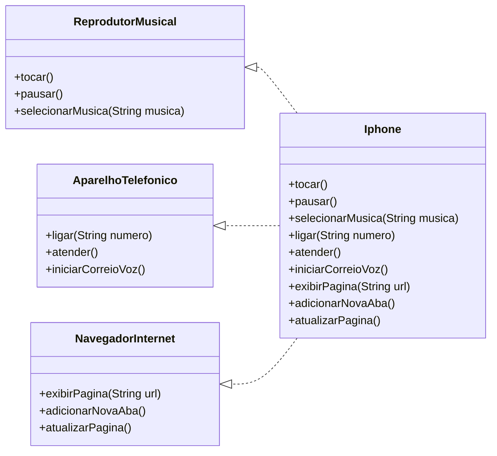

# iPhone UML - Bootcamp Java DIO

Este projeto representa a modelagem UML de um iPhone com suas principais funcionalidades.

## Diagrama de Classes

## Descrição

O diagrama acima mostra a estrutura do iPhone implementando três interfaces principais:

- **ReprodutorMusical**: Responsável pelas funcionalidades de reprodução de música
- **AparelhoTelefonico**: Responsável pelas funcionalidades de telefone
- **NavegadorInternet**: Responsável pelas funcionalidades de navegação web

A classe `Iphone` implementa todas essas interfaces, demonstrando o conceito de herança múltipla por meio de interfaces em Java.